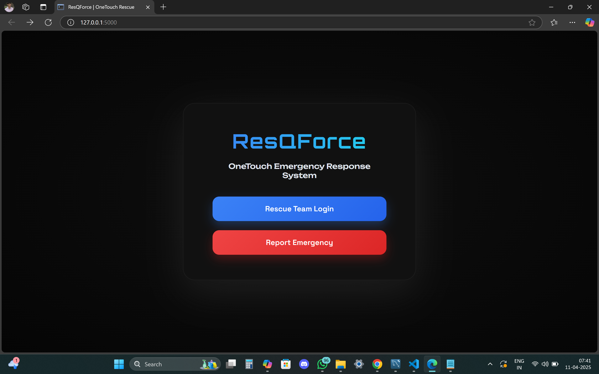

🚨 Rescue Management Web App

A real-time emergency reporting and management platform built with Flask and MySQL. Agencies can register, log in, view emergencies on a live map, and update their location to assist faster. Citizens can report emergencies which are immediately visible to all responding agencies.

)

🔧 Features

- 🧑‍🚒 **Agency Login & Registration**
- 🗺️ **Live Emergency Map with Severity Indicators**
- 🚨 **Report Emergency via Public API**
- 📍 **Track and Update Agency Location**
- 📊 **Dashboard with Pending Emergencies**
- 🔐 **Session-based Authentication**
- 🧼 **Delete All Emergencies (Admin Tool)**
- 🛡 **NDRF Command Dashboard**

🧱 Tech Stack

- Backend: Flask (Python)
- Database: MySQL
- Frontend: HTML, CSS, JavaScript (via Jinja templates)
- Other Tools: Flask-CORS, flask-mysqldb, LEAFLET.JS

📁 Project Structure

ResQForce/
├── app.py           
├── static/
│   ├── css/
│   │   ├── client.css
│   │   ├── dashboard.css
│   │   ├── emergency_map.css
│   │   ├── index.css
│   │   ├── login.css
│   │   └── register.css
│   └── js/
│       ├── dashboard.js
│       └── emergency_map.js
├── templates/
│   ├── client.html
│   ├── dashboard.html
│   ├── emergency_map.html
│   ├── index.html
│   ├── login.html
│   ├── ndrf_dashboard.html
│   └── register.html
└── requirements.txt            

# API endpoints
- POST /api/report_emergency
- GET  /api/emergencies
- POST /api/update_location
- GET  /api/agencies

